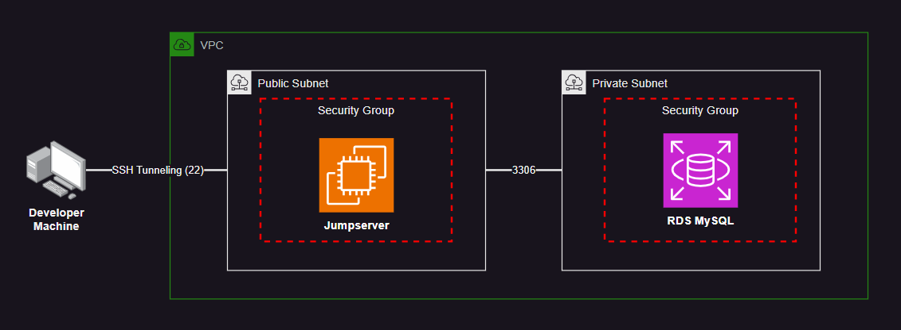

# AWS SSH Tunneling

Connecting from a local workstation to AWS RDS MySQL via SSH tunneling.




Create a `.auto.tfvars` a setup you

```terraform
aws_region         = "us-east-2"
rds_instance_class = "db.t4g.micro"
rds_multi_az       = false
rds_username       = "mysqladmin"
rds_password       = "p4ssw0rd"

jumpserver_allow_ssh = ["0.0.0.0/0"]
```

Create the infrastructure:

```sh
terraform init
terraform apply -auto-approve
```

Create a temporary key pair:

```sh
mkdir keys
ssh-keygen -f keys/temp_key
```

Add the key public key to the `.ssh/authorized_keys` file using SSM Run Command:

```sh
# Set "instance-id" and "SSH_PUB_KEY" values accordingly
aws ssm send-command \
    --targets "Key=InstanceIds,Values=instance-id" \
    --document-name "AWS-RunShellScript" \
    --comment "Add public key to SSH tunneling" \
    --parameters "commands='echo SSH_PUB_KEY >> /home/ubuntu/.ssh/authorized_keys'" \
    --output text
```

Check the command status:

```sh
aws ssm get-command-invocation \
    --command-id "ef7fdfd8-9b57-4151-a15c-db9a12345678" \
    --instance-id "i-1234567890abcdef0" \
    --query Status
```

Do a simple SSH connection test:

```sh
ssh -i keys/temp_key ubuntu@<INSTANCE_DNS>
```

Before creating the tunnel, enhance the security by allowing only your IP to connect via SSH:

```terraform
jumpserver_allow_ssh = ["YOUR PUBLIC IP/32"]
```

Apply the configuration.

```
ssh -i keys/temp_key -f -N -l ubuntu -L 3306:RDS_MYSQL_FQDN:3306  EC2_INSTANCE_FQDN -v
```

If the tunnel is created, you should now be able to connect to MySQL from your local machine.
